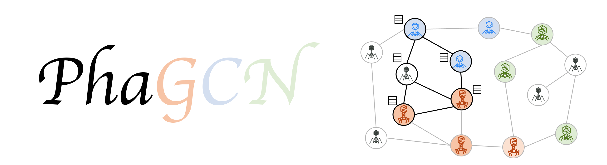

# PhaGCN



PhaGCN is a GCN based model, which can learn the species masking feature via deep learning classifier, for new Phage taxonomy classification. To use PhaGCN, you only need to input your contigs to the program.


# NEWS!!!

In the latest version of ICTV2022, many of the phage families in the previous ICTV are removed, including the Caoduvirales order. Thus, we update our program to the new ICTV2022 in a new GitHub folder: [PhaGCN_newICTV](https://github.com/KennthShang/PhaGCN_newICTV). We also tested the performance and it still remain high accuracy for the changes! Thus, feel free to use the new version if it is necessary.

According to the ICTV2022, the label set is listed below:

```
'Autographiviridae', 'Straboviridae', 'Herelleviridae', 'Drexlerviridae', 'Demerecviridae', 'Peduoviridae', 'Casjensviridae', 'Schitoviridae', 'Kyanoviridae', 'Ackermannviridae', 'Rountreeviridae', 'Salasmaviridae', 'Vilmaviridae', 'Zierdtviridae', 'Mesyanzhinovviridae', 'Chaseviridae', 'Zobellviridae', 'Orlajensenviridae', 'Guelinviridae', 'Steigviridae', 'Duneviridae', 'Pachyviridae', 'Winoviridae', 'Assiduviridae', 'Suoliviridae', 'Naomviridae', 'Intestiviridae', 'Crevaviridae', 'Pervagoviridae'
```
Please refer to the link for futher information: [ICTV](https://ictv.global/taxonomy)


# Required Dependencies
* Python 3.x
* Numpy
* Pytorch
* Networkx
* Pandas
* [Diamond](https://github.com/bbuchfink/diamond)
* MCL

All these packages can be installed using Anaconda.

If you want to use the gpu to accelerate the program:
* cuda  
* Pytorch-gpu

**Note:** please install the pytorch with correct cuda version corresponding to your system

## An easiler way to install
We recommend you to install all the package with [Anaconda](https://anaconda.org/)

After cloning this respository, you can use anaconda to install the **environment.yaml**. This will install all packages you need with gpu mode (make sure you have installed cuda on your system).

      conda env create -f environment.yaml -n phagcn
      conda activate phagcn

**Note:** please install the pytorch with correct cuda version corresponding to your system, if you want to use gpu.


# Usage (example)
Here we present an example to show how to run PhaGCN. We support a file named "contigs.fa" in the Github folder and it contain contigs simulated from E. coli phage. The only command that you need to run is `python run_Speed_up.py --contigs contigs.fa --len 8000`. 

There are two parameters for the program: 1. `--contigs` is the path of your contigs file. 2. `--len` is the length of the contigs you want to predict. As shown in our paper, with the length of contigs increases, the recall and precision increase. We recommend you to choose a proper length according to your needs. The default length is 8000bp and the minimum length is 2000bp. 

The output file is **final_prediction.csv**. There are three column in this csv file: "contig_name, median_file_name, prediction".

PhaGCN will only trained on the current given database. But you can update the database if required.

# Notice
If you want to use PhaGCN, you need to take care of two things:
1. Make sure all your contigs are virus contigs. You can separate bacteria contigs by using [PhaMer](https://github.com/KennthShang/PhaMer)
2. The script will pass contigs with non-ACGT characters, which means those non-ACGT contigs will be remained unpredict.
3. if the program output an error (which is caused by your machine):
`Error: mkl-service + Intel(R) MKL: MKL_THREADING_LAYER=INTEL is incompatible with libgomp.so.1 library.`
You can type in the command `export MKL_SERVICE_FORCE_INTEL=1` before runing *run_Speed_up.py*

# References
how to cite this tool:
```
Jiayu Shang, Jingzhe Jiang, Yanni Sun, Bacteriophage classification for assembled contigs using graph convolutional network, Bioinformatics, Volume 37, Issue Supplement_1, July 2021, Pages i25–i33, https://doi.org/10.1093/bioinformatics/btab293
```

## Supplementary information
The supplementary file of the paper can be found in the supplementary folder.

## Contact
If you have any questions, please email us: jyshang2-c@my.cityu.edu.hk
